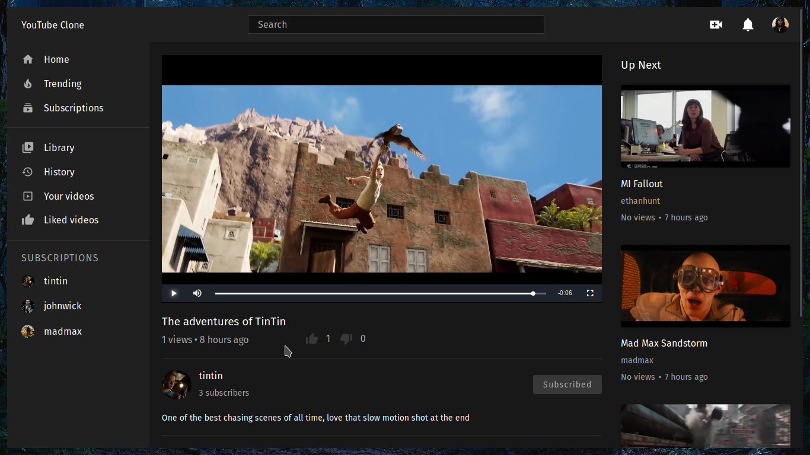
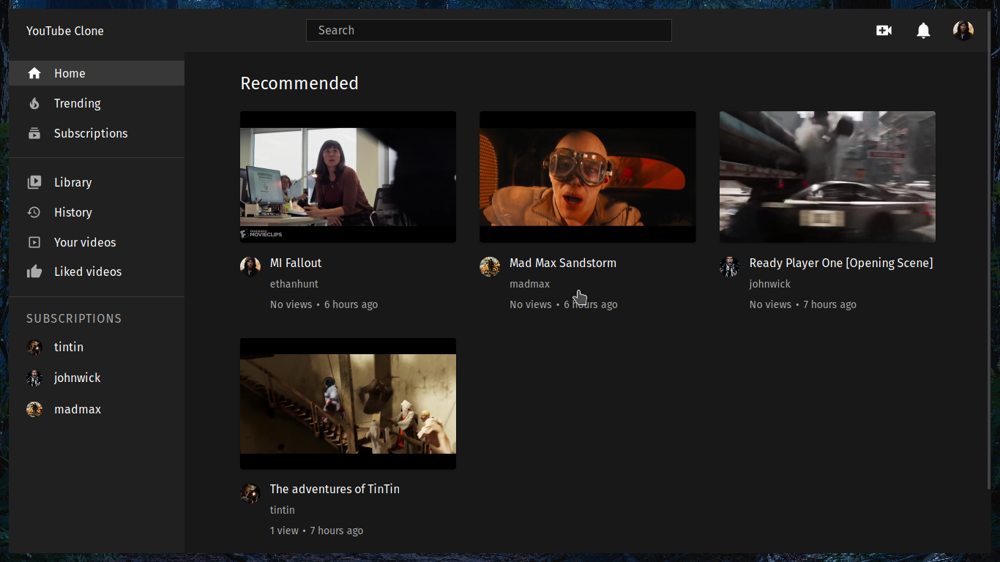
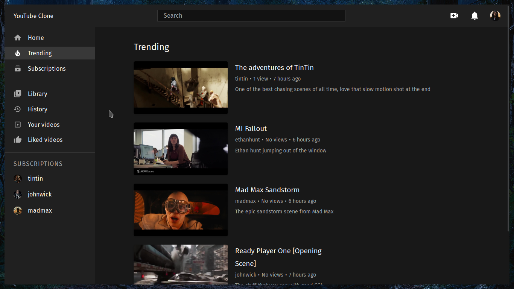
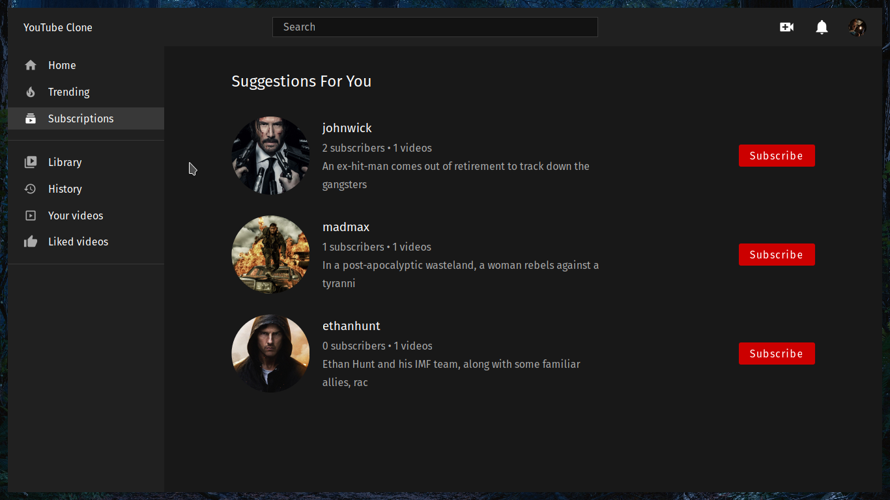
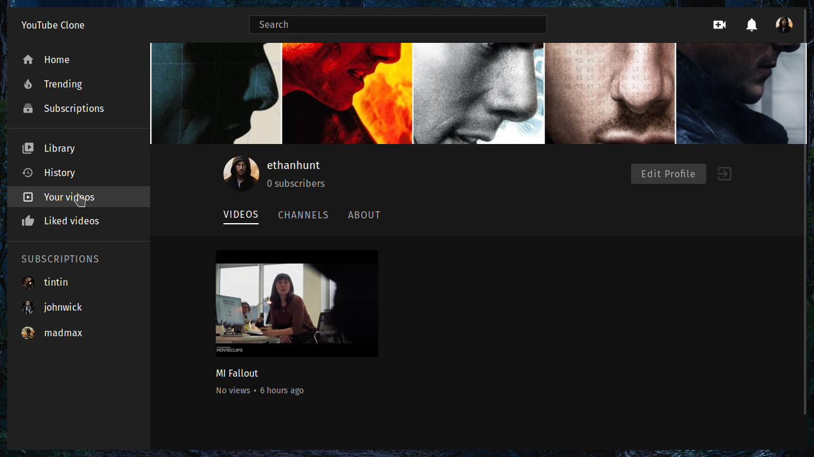
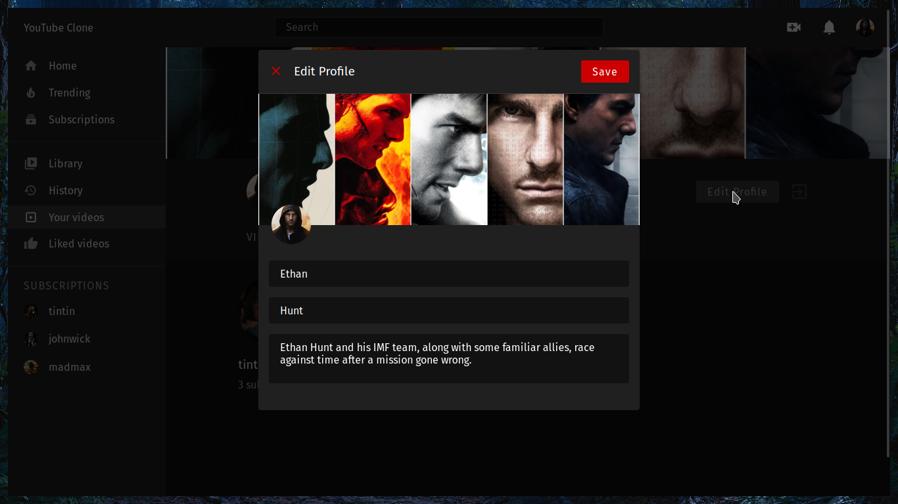
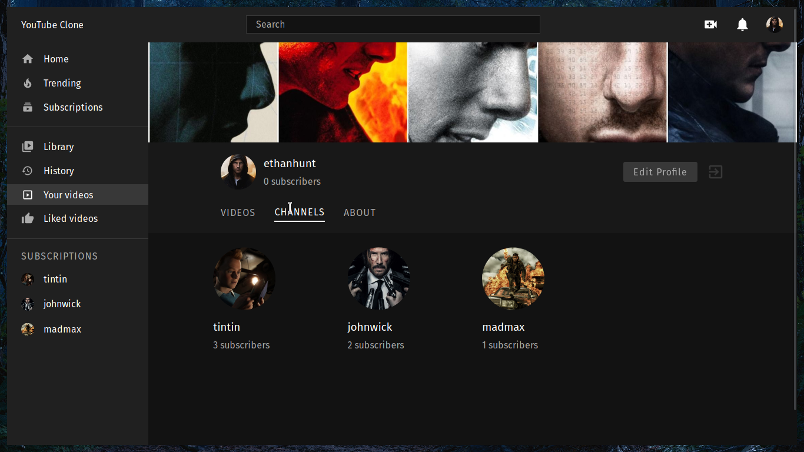
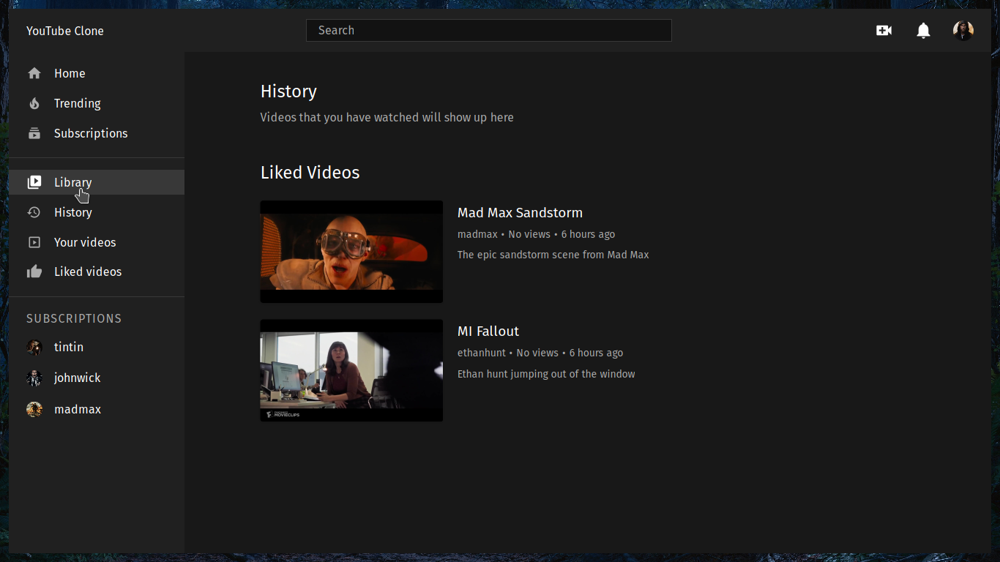
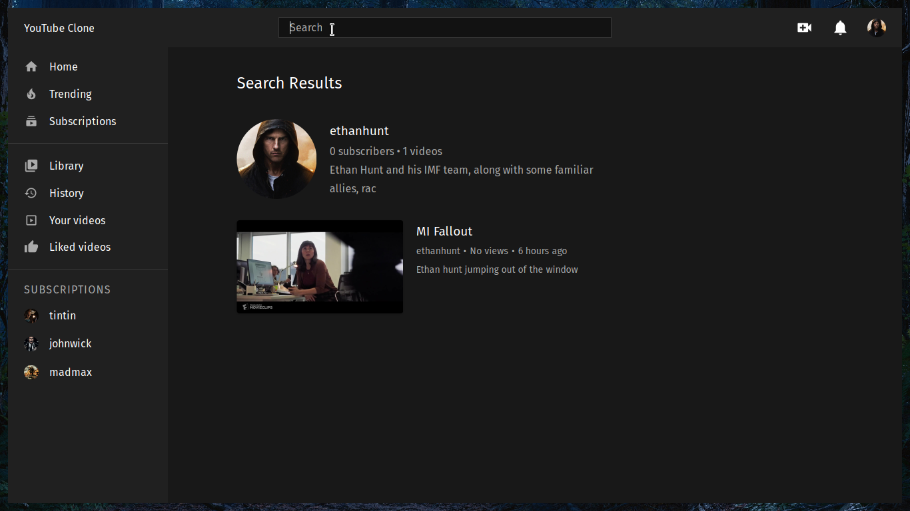

# Youtube Clone Frontend

## Features

1. Login/Signup
2. Upload video
3. Search video by channel name
4. Search video by title, description
5. Like/Dislike video
6. Subscribe/Unsubscribe from channels
7. Add comment
8. Edit profile (avatar, cover)
9. Liked videos
10. History

## Running locally

At the root of your project create an .env file with the following contents:

```javascript
REACT_APP_BACKEND_URL=<YOUR_BACKEND_URL>
REACT_APP_CLOUDINARY_ENDPOINT=https://api.cloudinary.com/v1_1/<YOUR_CLOUD_NAME>
```

Then run <code>npm i</code> and <code>npm start</code> to see the youtube clone in action

## Watch the Demo

[](https://youtu.be/wHLurtOnmyM "Youtube Clone Demo")

## UI

### Home



### Trending



### Watch


### Suggestions



### Channel



### Edit Profile





### Library



### Search




1. Twitter

   - [Frontend](https://github.com/manikandanraji/twitter-clone-frontend)
   - [Backend](https://github.com/manikandanraji/twitter-clone-frontend)

2. Instagram
   - [Frontend](https://github.com/manikandanraji/instaclone-frontend)
   - [Backend](https://github.com/manikandanraji/instaclone-backend)
